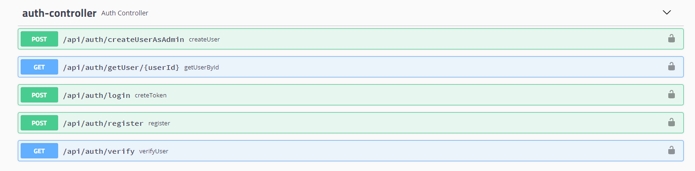
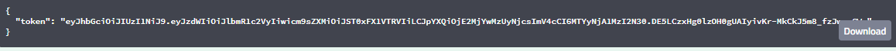
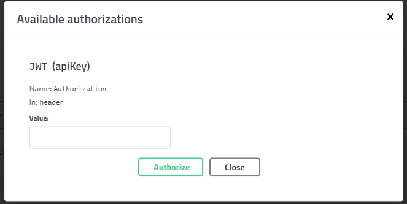
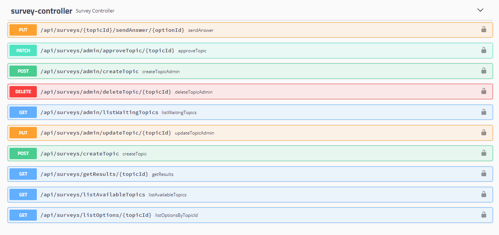

# Survey API 

*Batuhan Karaman*

 
 
 

## Proje Özellikleri

- Kullanıcıların sisteme giriş yaparak belirli konularda sorulan soruları görüntüleyebilmesi ve cevap verebilmesi amaçlanmıştır. 

- Sistemde yönetici ('ADMIN'), son kullanıcı ('USER') rollerine sahip iki farklı kullanıcı tipi vardır. 

- Yöneticiler, onaylı olarak soru ve seçenek ekleyebilir. Kullanıcılar soru ekleyebilirler fakat ilgili sorunun cevaplanabilir olması için yönetici onayına ihtiyaç vardır.

- Sistemdeki sorular ve seçeneklerin seçilme sayısı listelenebilir. Her soru için bir seçenek seçilerek cevap sisteme gönderilebilir.

 

### Kullanılan Teknolojiler

- JDK Version 11
- Spring Boot Version 2.5.2
- PostgreSQL 

 

## Auth Modülü
---

 
 

Sistemde başlangıç verisi olarak 2 kullanıcı tanımlanmıştır. 

- ADMIN rolüne sahip kullanıcı;
> **username** : admin , **password** : admin12345

 

- USER rolüne sahip kullanıcı;
> **username** : enduser , **password** : enduser12345

 

- **[POST]**/api/auth/login endpointine istek atarak kimlik doğrulaması yapılabilir. Doğrulama başarılıysa cevap olarak JWT token dönecektir.

 

 
 

Token ile yetkilendirme Swagger üzerinden yapılacaksa, sayfanın sağ-üst tarafında bulunan 'Authorize' butonuna tıklanarak pop-up açılır.

 

 
 

>  Bearer eyJhbGciOiJIUzI1NiJ9... 

formatında değer olarak girilerek yetkilendirme işlemi yapılır.

- **createUserAsAdmin** endpoint'i, yönetici tarafından rol ve kullanıcı bilgileri ile sisteme kullanıcı eklemeyi sağlar. 

- Eğer '**register**' endpoint'i kullanılarak kayıt olunacaksa, kayıt sırasında verilen e-posta adresine onay e-postası gelecektir. Gelen e-postadaki bağlantıya tıklanarak '**verify**' endpoint'ine ulaşılır ve hesap doğrulanır. Aksi halde yetkilendirme başarısız olacaktır. 

 
 

## Survey Modülü
---

 

 
 

- Bu modülde ***'/api/surveys/admin/\*'*** yoluyla ulaşılan endpointler, yönetici rolüne sahip kullanıcılar tarafından kullanılır. 

- **Onaylanmış soru eklemek** için ***'/admin/createTopic'*** endpointine istek atılabilir. Diğer yönetici yetkili CRUD metotları Swagger dokümantasyonunda görülebilir.

- **Onay bekleyen soruları görmek** için ***'/admin/listWaitingTopics'***, bir **soruyu onaylamak** için ***'/admin/approveTopic/{topicId}'*** endpointlerine istek atılabilir. 

- Son kullanıcı olarak, **onaylanmış soruları listelemek için** ***'/listAvailableTopics'***, **bir soruyu cevaplamak için** ise sorunun ve seçeneğin ID'leri ile ***'/{topicId}/sendAnswer/{optionId}'*** endpointine istek atılabilir.

